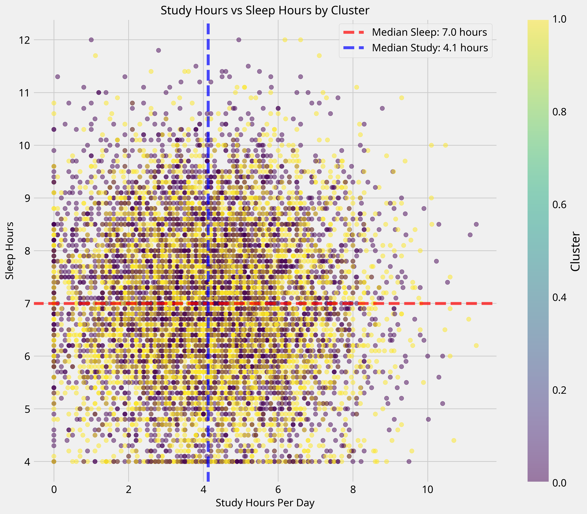

# Student Habits and Academic Performance Analysis

This data science project analyzes the relationship between student habits and academic performance using a comprehensive dataset of 80,000 student records. The project employs multiple data science techniques including regression analysis, clustering, and classification to uncover insights about factors influencing student success.

## Project Overview

This project aims to understand how various student habits and characteristics affect academic performance, specifically exam scores. By analyzing factors such as study habits, sleep patterns, social activities, and other lifestyle variables, we can identify key predictors of academic success and provide actionable insights for students and educators.

## Dataset

The dataset contains 80,000 student records with 31 original features including:

- Demographic information (age, gender, major)
- Study habits (study hours, attendance percentage)
- Lifestyle factors (sleep hours, social media usage, Netflix hours)
- Wellness indicators (diet quality, exercise frequency, mental health rating)
- Academic background (previous GPA, semester)
- Environmental factors (study environment, internet quality)
- Psychological factors (stress level, motivation, exam anxiety)

## Methodology

The project follows a comprehensive data science workflow:

1. **Data Exploration and Preprocessing**
   - Exploratory data analysis
   - Feature engineering
   - Data cleaning and transformation

2. **Regression Analysis**
   - Linear regression to predict exam scores
   - Feature importance analysis
   - Model evaluation (R² = 0.87)

3. **Clustering Analysis**
   - Dimensionality reduction with PCA
   - MiniBatchKMeans clustering
   - Cluster profiling and visualization

4. **Classification Analysis**
   - Random Forest classification to predict high vs. low performers
   - Feature importance analysis
   - Model evaluation (Accuracy = 89.7%)

5. **Results Integration and Interpretation**
   - Cross-analysis of findings
   - Visualization of key insights
   - Actionable recommendations

## Key Findings

### Regression Analysis
- The model explains approximately 87% of the variance in exam scores
- Previous GPA is the strongest predictor of exam performance
- Screen time and certain majors show negative correlation with exam scores

### Clustering Analysis
- Two distinct clusters of students were identified
- Clusters show similar average exam scores but differ in study patterns and lifestyle habits

### Classification Analysis
- High-performing students can be predicted with 89.7% accuracy
- Previous GPA, academic engagement, and motivation level are top predictors
- High performers tend to have better time management and lower screen time

### Integrated Insights
1. Academic engagement and study hours are consistently strong predictors of exam performance
2. Sleep quality and wellness scores show significant positive correlation with academic performance
3. Screen time and social media usage show negative correlation with exam scores
4. Time management skills appear to be more important than raw study hours
5. Students with balanced lifestyles (adequate sleep, exercise, and study) tend to perform better

## Visualizations

### Correlation Heatmap


### Feature Importance Comparison


### Study Hours vs. Sleep Hours by Cluster


### Wellness Score vs. Academic Engagement


## Recommendations

1. **Focus on academic engagement** through interactive learning methods
2. **Promote healthy sleep habits** and wellness practices
3. **Teach effective time management skills** rather than just encouraging more study hours
4. **Develop strategies to manage screen time** and social media usage
5. **Create support systems** that encourage balanced lifestyles

## Project Structure

```
student_performance_project/
│
├── code/                              # Python scripts for analysis
│   ├── 1_data_exploration.py          # Initial data exploration
│   ├── 2_data_preprocessing_final.py  # Data cleaning and feature engineering
│   ├── 3_regression_analysis_final.py # Regression modeling
│   ├── 4_clustering_analysis_optimized.py # Clustering analysis
│   ├── 5_classification_analysis_optimized.py # Classification modeling
│   └── 6_results_interpretation.py    # Results integration and visualization
│
├── enhanced_student_habits_performance_dataset/ # Original dataset
│
├── output/                            # Analysis outputs and processed data
│   ├── processed_data_with_features.csv  # Preprocessed data with engineered features
│   ├── encoded_data_for_modeling.csv     # Fully encoded data for modeling
│   ├── regression_results.csv            # Regression model performance metrics
│   ├── regression_coefficients.csv       # Feature importance from regression
│   ├── clustered_data.csv                # Data with cluster assignments
│   ├── cluster_analysis.csv              # Cluster profiles and characteristics
│   ├── classification_results.csv        # Classification model performance metrics
│   ├── classification_feature_importance.csv # Feature importance from classification
│   ├── high_vs_low_performers_comparison.csv # Comparison of high vs. low performers
│   └── comprehensive_findings.txt        # Summary of all findings and insights
│
└── visualizations/                    # Generated visualizations
    ├── regression_*.png               # Regression analysis visualizations
    ├── cluster_*.png                  # Clustering analysis visualizations
    ├── classification_*.png           # Classification analysis visualizations
    └── integrated_*.png               # Integrated analysis visualizations
```

## How to Run the Project

1. Clone this repository
2. Install required dependencies:
   ```
   pip install pandas numpy matplotlib seaborn scikit-learn
   ```
3. Run the scripts in numerical order:
   ```
   python code/1_data_exploration.py
   python code/2_data_preprocessing_final.py
   python code/3_regression_analysis_final.py
   python code/4_clustering_analysis_optimized.py
   python code/5_classification_analysis_optimized.py
   python code/6_results_interpretation.py
   ```

## Conclusion

This analysis demonstrates that academic success is influenced by a complex interplay of factors beyond just study hours. A balanced approach to student life that includes proper sleep, wellness practices, and effective time management appears to be more beneficial than focusing solely on study time. Educational institutions could benefit from promoting holistic student development rather than emphasizing only academic activities.

The strong predictive power of our models (R² = 0.87 for regression, 89.7% accuracy for classification) suggests that student performance can be reliably predicted and potentially improved by addressing the key factors identified in this analysis.
