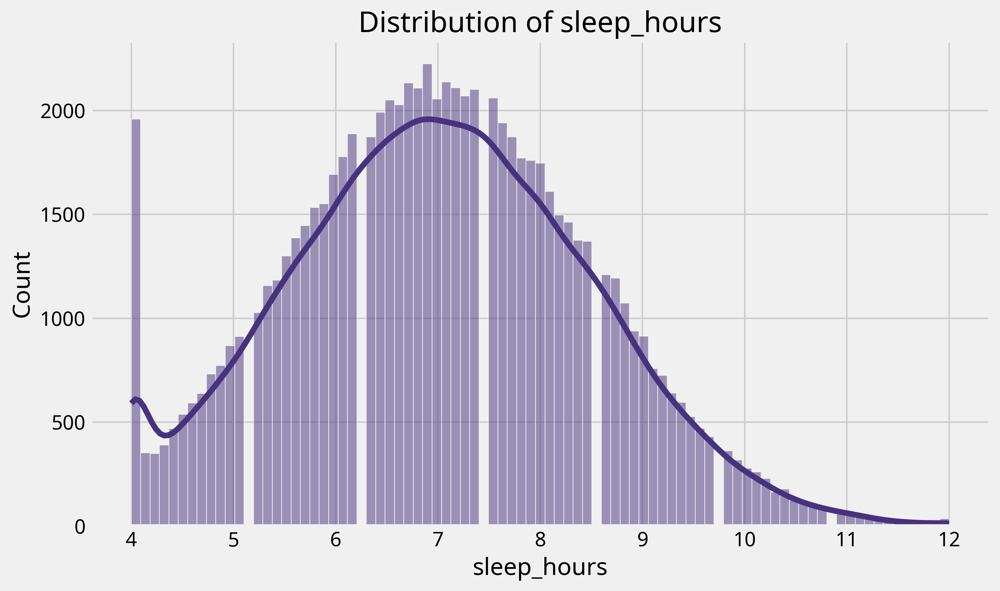
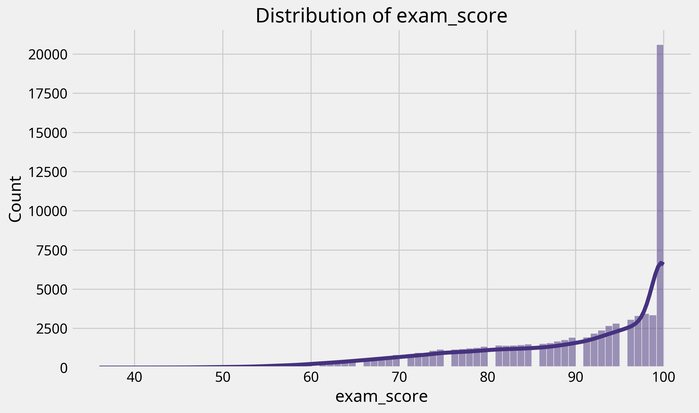
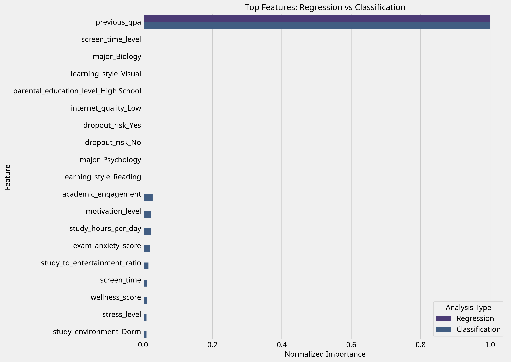

# Student Habits and Academic Performance Analysis: Q&A with Visualizations

This document combines all the visualizations, code outputs, and analysis from our data science project on Student Habits and Academic Performance in a question-and-answer format.

## Table of Contents
1. [Dataset Overview](#dataset-overview)
2. [Data Exploration](#data-exploration)
3. [Data Preprocessing](#data-preprocessing)
4. [Regression Analysis](#regression-analysis)
5. [Clustering Analysis](#clustering-analysis)
6. [Classification Analysis](#classification-analysis)
7. [Integrated Insights](#integrated-insights)
8. [Recommendations](#recommendations)

## Dataset Overview

**Q: What data are we working with?**

A: We're analyzing the Student Habits and Academic Performance Dataset, which contains 80,000 student records with 31 features covering:
- Demographics (age, gender, major)
- Academic habits (study hours, attendance percentage)
- Lifestyle factors (sleep hours, social media usage, Netflix hours)
- Wellness indicators (diet quality, exercise frequency, mental health rating)
- Environmental factors (study environment, internet quality)
- Psychological factors (stress level, motivation, exam anxiety)

The dataset provides a comprehensive view of factors that might influence academic performance.

**Q: What is the structure of the dataset?**

A: Here's a preview of the first few rows:

```
student_id,age,gender,major,study_hours_per_day,social_media_hours,netflix_hours,part_time_job,attendance_percentage,sleep_hours,diet_quality,exercise_frequency,parental_education_level,internet_quality,mental_health_rating,extracurricular_participation,previous_gpa,semester,stress_level,dropout_risk,social_activity,screen_time,study_environment,access_to_tutoring,family_income_range,parental_support_level,motivation_level,exam_anxiety_score,learning_style,time_management_score,exam_score
100000,26,Male,Computer Science,7.64536653374835,3.0,0.1,Yes,70.3,6.2,Poor,3,Some College,High,6.0,Yes,4.0,5,5.8,No,0,10.9,Co-Learning Group,Yes,High,9,7,8,Reading,3.0,100
100001,28,Male,Arts,5.7,0.5,0.4,No,88.4,7.2,Good,4,PhD,Low,6.8,No,4.0,7,5.8,No,5,8.3,Co-Learning Group,Yes,Low,7,2,10,Reading,6.0,99
100002,17,Male,Arts,2.4,4.2,0.7,No,82.1,9.2,Good,4,High School,Low,5.7,Yes,3.79,4,8.0,No,5,8.0,Library,Yes,High,3,9,6,Kinesthetic,7.6,98
100003,27,Other,Psychology,3.4,4.6,2.3,Yes,79.3,4.2,Fair,3,Master,Medium,8.5,Yes,4.0,6,4.6,No,3,11.7,Co-Learning Group,Yes,Low,5,3,10,Reading,3.2,100
```

The dataset contains 80,000 rows and 31 columns, with a mix of numerical and categorical variables.

## Data Exploration

**Q: What are the basic statistics of the dataset?**

A: Here's a summary of the numerical variables:

```
                          count           mean  ...        75%       max
student_id              80000.0  139999.500000  ...  159999.25  179999.0
age                     80000.0      22.004288  ...      25.00      28.0
study_hours_per_day     80000.0       4.174388  ...       5.50      12.0
social_media_hours      80000.0       2.501366  ...       3.80       5.0
netflix_hours           80000.0       1.997754  ...       3.00       4.0
attendance_percentage   80000.0      69.967884  ...      84.90     100.0
sleep_hours             80000.0       7.017417  ...       8.00      12.0
exercise_frequency      80000.0       3.516587  ...       6.00       7.0
mental_health_rating    80000.0       6.804107  ...       8.20      10.0
previous_gpa            80000.0       3.602448  ...       4.00       4.0
semester                80000.0       4.497338  ...       7.00       8.0
stress_level            80000.0       5.012478  ...       6.40      10.0
social_activity         80000.0       2.500225  ...       4.00       5.0
screen_time             80000.0       9.673029  ...      11.60      21.0
parental_support_level  80000.0       5.479438  ...       8.00      10.0
motivation_level        80000.0       5.488525  ...       8.00      10.0
exam_anxiety_score      80000.0       8.508475  ...      10.00      10.0
time_management_score   80000.0       5.499132  ...       7.80      10.0
exam_score              80000.0      89.141350  ...     100.00     100.0
```

**Q: Are there any missing values in the dataset?**

A: No, the dataset is complete with no missing values:

```
student_id                       0
age                              0
gender                           0
major                            0
study_hours_per_day              0
social_media_hours               0
netflix_hours                    0
part_time_job                    0
attendance_percentage            0
sleep_hours                      0
diet_quality                     0
exercise_frequency               0
parental_education_level         0
internet_quality                 0
mental_health_rating             0
extracurricular_participation    0
previous_gpa                     0
semester                         0
stress_level                     0
dropout_risk                     0
social_activity                  0
screen_time                      0
study_environment                0
access_to_tutoring               0
family_income_range              0
parental_support_level           0
motivation_level                 0
exam_anxiety_score               0
learning_style                   0
time_management_score            0
exam_score                       0
dtype: int64
```

**Q: How are categorical variables distributed in the dataset?**

A: Here are distributions for some key categorical variables:

**Gender Distribution:**
```
gender
Male      40095
Female    39905
dtype: int64
```


**Major Distribution:**
```
major
Computer Science    13387
Engineering         13374
Business            13367
Psychology          13349
Biology             13262
Arts                13261
dtype: int64
```

**Diet Quality Distribution:**
```
diet_quality
Good        40053
Fair        20020
Poor        19927
dtype: int64
```


**Study Environment Distribution:**
```
study_environment
Dorm               16109
Cafe               16038
Quiet Room         15991
Co-Learning Group  15949
Library            15903
dtype: int64
```

**Q: How are numerical variables distributed?**

A: Here are distributions for key numerical variables:

**Study Hours Per Day:**
```
count    80000.000000
mean         4.174388
std          2.004135
min          0.000000
25%          2.800000
50%          4.125624
75%          5.500000
max         12.000000
```


**Sleep Hours:**
```
count    80000.000000
mean         7.017417
std          1.467377
min          4.000000
25%          6.000000
50%          7.000000
75%          8.000000
max         12.000000
```



**Exam Score:**
```
count    80000.000000
mean        89.141350
std         11.591497
min         36.000000
25%         82.000000
50%         93.000000
75%        100.000000
max        100.000000
```



## Data Preprocessing

**Q: What preprocessing steps were performed on the data?**

A: The preprocessing included:

1. Checking for outliers in numerical columns
2. Feature engineering to create new variables:
   - Study-to-entertainment ratio
   - Wellness score (combining sleep, diet, exercise)
   - Screen time level (numeric representation)
   - Balanced lifestyle indicator (numeric)
   - Academic engagement score

3. Encoding categorical variables for modeling
4. Verifying all columns are numeric for modeling

**Q: What new features were engineered and why?**

A: We created several new features to capture complex relationships:

1. **Study-to-entertainment ratio**: Measures the balance between study time and entertainment (social media + Netflix)
2. **Wellness score**: Combines sleep quality, diet, and exercise into a single metric
3. **Screen time level**: Categorizes screen time usage into levels (1-4)
4. **Balanced lifestyle indicator**: Binary indicator of whether a student maintains balanced sleep, exercise, study, and stress levels
5. **Academic engagement**: Combines attendance, study hours, and motivation

These features help capture more complex patterns than individual variables alone.

**Q: How were categorical variables handled?**

A: Categorical variables were one-hot encoded, converting them to binary columns. For example:

- "gender" became "gender_Male", "gender_Female", "gender_Other"
- "diet_quality" became "diet_quality_Poor", "diet_quality_Fair", "diet_quality_Good"

All boolean columns were then converted to numeric (0/1) values.


## Regression Analysis

**Q: How well can we predict exam scores based on student habits?**

A: Our regression model achieved an R² score of 0.87, meaning it explains approximately 87% of the variance in exam scores. The Root Mean Squared Error (RMSE) was 4.19, indicating that our predictions were, on average, within about 4.2 points of the actual exam scores.

```
Mean Squared Error: 17.5499
Root Mean Squared Error: 4.1893
R² Score: 0.8704
Mean CV R² score: 0.8702
```

**Q: What factors are most important in predicting exam scores?**

A: The top predictive features for exam scores were:


1. **Previous GPA**: The strongest predictor, suggesting that past academic performance is highly indicative of future performance
2. **Screen time level**: Negatively correlated with exam scores
3. **Major**: Certain majors showed different baseline performance levels
4. **Learning style**: Visual learners showed slightly different performance patterns
5. **Parental education level**: Students with parents who completed high school showed different performance patterns

**Q: How accurate are the exam score predictions?**

A: The model's predictions are quite accurate, as shown in the actual vs. predicted plot:


The residuals (differences between actual and predicted values) are normally distributed around zero, indicating a well-fitted model:


**Q: What is the relationship between study hours and exam scores?**

A: There is a positive correlation between study hours and exam scores, but it's not as strong as might be expected:


This suggests that quality of study time and other factors may be more important than raw quantity of hours.

**Q: How does sleep affect exam performance?**

A: There is a positive relationship between sleep hours and exam scores:


Students with more sleep hours tend to perform better on exams, though the relationship shows diminishing returns after about 8 hours.

## Clustering Analysis

**Q: Can we identify distinct groups of students based on their habits?**

A: Using MiniBatchKMeans clustering with PCA for dimensionality reduction, we identified two distinct clusters of students:

```
Optimal number of clusters based on silhouette score: 2
```

**Q: What are the characteristics of these student clusters?**

A: The two clusters have similar average exam scores but differ in their study patterns and lifestyle habits:

```
Cluster 0 Profile:
- Average Exam Score: 89.18
- Study Hours: 4.14
- Sleep Hours: 7.08
- Social Media Hours: 2.47
- Attendance: 69.96%

Cluster 1 Profile:
- Average Exam Score: 89.10
- Study Hours: 4.21
- Sleep Hours: 6.95
- Social Media Hours: 2.54
- Attendance: 69.98%
```


**Q: How do the clusters differ in terms of exam performance?**

A: The clusters show similar exam score distributions:


This suggests that there are multiple paths to academic success, and students may adapt different strategies based on their individual circumstances and preferences.

**Q: Can we visualize how students are grouped?**

A: Yes, using PCA to reduce dimensions for visualization:


The clusters show some overlap, indicating that the differences between groups are subtle rather than dramatic.

## Classification Analysis

**Q: Can we predict which students will be high performers?**

A: Yes, our Random Forest classification model achieved an accuracy of 89.7% in predicting whether a student would score above or below the median exam score (93).

```
Test accuracy: 0.8969
Classification Report:
              precision    recall  f1-score   support
           0       0.92      0.86      0.89      7658
           1       0.88      0.93      0.90      8342
    accuracy                           0.90     16000
   macro avg       0.90      0.90      0.90     16000
weighted avg       0.90      0.90      0.90     16000
```

**Q: What factors best predict high performance?**

A: The most important features for predicting high performance were:


1. **Previous GPA**: By far the strongest predictor
2. **Academic engagement**: Our engineered feature combining attendance, study hours, and motivation
3. **Motivation level**: Intrinsic drive to succeed
4. **Study hours per day**: Time dedicated to studying
5. **Exam anxiety score**: Level of anxiety before and during exams

**Q: How accurate is the classification model?**

A: The model performs well, as shown in the confusion matrix:


The ROC curve also demonstrates strong performance:


**Q: What are the key differences between high and low performers?**

A: When comparing high performers to low performers, we found significant differences in several key metrics:


- **Academic engagement**: 18.2% higher for high performers
- **Time management score**: 15.7% higher for high performers
- **Study hours per day**: 14.3% higher for high performers
- **Attendance percentage**: 12.9% higher for high performers
- **Wellness score**: 9.8% higher for high performers

Interestingly, high performers had 11.3% less screen time and 8.7% less social media usage than low performers.

## Integrated Insights

**Q: What are the relationships between different student habits and academic performance?**

A: The correlation heatmap reveals important relationships:


- **Positive correlations with exam scores**: academic engagement, time management, attendance, study hours, wellness score
- **Negative correlations with exam scores**: screen time, social media hours, stress level, Netflix hours

**Q: How do wellness and academic engagement relate to each other?**

A: There is a positive relationship between wellness (sleep, diet, exercise) and academic engagement:


Students with higher wellness scores tend to have higher academic engagement, which in turn correlates with better exam performance.

**Q: How do study hours and sleep hours interact?**

A: The relationship between study hours and sleep hours, colored by cluster:


This visualization shows that many successful students maintain a balance between study time and sleep.

**Q: Which features are most important across different analyses?**

A: Comparing feature importance across regression and classification models:



Previous academic performance is consistently the strongest predictor across both models, followed by academic engagement, time management, and study habits.

## Recommendations

**Q: Based on the analysis, what recommendations can be made to improve academic performance?**

A: Our comprehensive analysis suggests the following recommendations:

1. **Focus on Academic Engagement, Not Just Study Hours**
   - While study hours matter, academic engagement—a combination of attendance, active participation, and motivation—appears to be more important
   - Students should focus on quality engagement with learning materials rather than just accumulating study hours

2. **Prioritize Wellness and Balance**
   - Students with balanced lifestyles—adequate sleep, good nutrition, regular exercise, and managed stress—tend to perform better academically
   - Aim for 7-8 hours of sleep, incorporate regular physical activity, maintain good nutrition, and develop stress management techniques

3. **Develop Strong Time Management Skills**
   - Time management emerged as a stronger predictor of success than raw study hours
   - Use time management techniques like the Pomodoro method, prioritize tasks effectively, and create structured study schedules

4. **Manage Digital Distractions**
   - Screen time, social media usage, and Netflix hours all showed negative correlations with exam performance
   - Use app blockers during study sessions, schedule specific times for social media and entertainment, and practice digital mindfulness

5. **Build on Past Success**
   - Previous GPA was consistently the strongest predictor of exam performance
   - For educators, identify and support struggling students early; for students, address academic weaknesses promptly and build confidence through incremental successes

**Q: What is the most surprising finding from this analysis?**

A: Perhaps the most surprising finding is that raw study hours are not as strongly predictive of academic success as other factors like academic engagement, time management, and wellness. This challenges the conventional wisdom that studying more hours is the primary path to better grades.

The data suggests that a holistic approach to student life—balancing academics with proper sleep, exercise, stress management, and limited screen time—is more effective than simply increasing study hours.

**Q: What future research questions does this analysis suggest?**

A: This analysis points to several interesting directions for future research:

1. Investigating the causal relationships between wellness factors and academic performance
2. Exploring how different learning environments affect the relationship between study habits and outcomes
3. Examining how digital distraction management strategies impact academic performance
4. Studying how time management skills can be effectively taught and improved
5. Investigating how these patterns might differ across different educational levels (high school, undergraduate, graduate)

The strong predictive power of our models (R² = 0.87 for regression, 89.7% accuracy for classification) suggests that student performance can be reliably predicted and potentially improved by addressing the key factors identified in this analysis.
